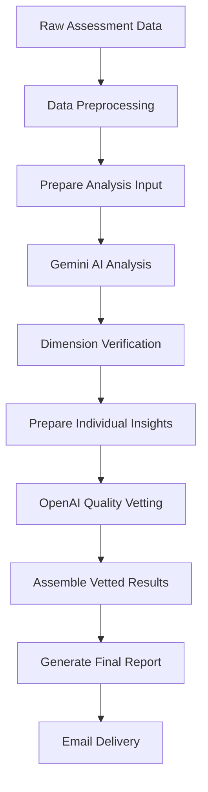

# AI Psychological Assessment System

An AI-powered workflow for analyzing teenager psychological development through multi-perspective questionnaire responses and generating actionable parenting reports.

##  Overview

This system processes psychological assessment data from both teenagers and their parents, using advanced AI analysis to generate reliable, insightful, and actionable developmental reports. The workflow combines prompt engineering, context engineering, and workflow automation to ensure high-quality, trustworthy outputs.

##  Architecture

### Multi-Stage AI Pipeline

```
Raw Data → Preprocessing → AI Analysis → Quality Vetting → Report Generation
    ↓           ↓            ↓             ↓              ↓
  n8n Node    Python      Gemini AI    OpenAI GPT    Final Report
```

### Core Components

1. **Data Preprocessing** (`All_in_One_FIXED.py`)
2. **AI Analysis** (Gemini with structured prompts)
3. **Quality Assurance** (Multi-layer vetting system)
4. **Report Generation** (OpenAI with specialized prompts)

##  Technical Implementation

### 1. Data Processing Pipeline

**File: `All_in_One_FIXED.py`**
- Handles n8n JsProxy objects conversion
- Extracts longitudinal assessment data
- Generates time-series trends for 75+ psychological dimensions
- Processes qualitative free-text responses

```python
# Key features:
- JsProxy to Python conversion
- Time-series trend calculation
- Multi-perspective data aggregation
- Robust error handling
```

### 2. AI Analysis Engine

**File: `analysis_FIXED.md`**
- Structured Gemini prompt for psychological analysis
- Role-based context engineering (adolescent psychologist)
- Strict output format enforcement
- Anti-hallucination safeguards

**Key Prompt Engineering Features:**
- **Objective Analysis**: Only references actual data dimensions
- **Empathetic Tone**: Professional, constructive approach
- **No Diagnoses**: Focuses on developmental observations
- **Structured Output**: Enforced JSON format

### 3. Quality Assurance System

#### Dimension Verification
**Files: `verify_all_insights.py`, `verify_vetting_FINAL.py`**
- Validates against 75 real psychological dimensions
- Identifies fabricated dimensions (hallucinations)
- Provides confidence predictions
- Batch processing for efficiency

#### Content Vetting
**Files: `prepare_for_vetting_FIXED.py`, `insight_score_FIXED.md`**
- Individual insight scoring (1-5 scale)
- Evidence-based confidence assessment
- OpenAI-powered quality evaluation

### 4. Report Generation

**File: `report_FIXED.md`**
- Parent-focused, actionable recommendations
- Markdown formatting for clarity
- Empathetic, non-judgmental tone
- Practical "Do/Don't Say" guidance

##  Workflow Orchestration

### n8n Automation Flow



### Key Automation Features

- **Multi-step Processing**: Orchestrated through n8n
- **Error Handling**: Robust failure recovery at each stage
- **Quality Gates**: Multiple verification layers
- **Scalable Architecture**: Easy model/metric integration

##  Quality Assurance Measures

### 1. Hallucination Prevention

- **Dimension Validation**: Cross-references against real assessment dimensions
- **Evidence Requirements**: All insights must cite specific data
- **Structured Outputs**: JSON schema enforcement
- **Multi-layer Verification**: Gemini analysis → Dimension check → OpenAI vetting

### 2. Confidence Scoring

```python
# Confidence levels:
5 = Fully supported by strong evidence
4 = Well supported with minor gaps
3 = Moderately supported
2 = Weakly supported
1 = Not supported by evidence
```

### 3. Content Quality

- **Evidence-Based**: All insights tied to specific trends/scores
- **Actionable**: Practical parenting recommendations
- **Empathetic**: Supportive, non-judgmental tone
- **Professional**: Clinical psychology expertise embedded

##  Reliability Features

### Data Integrity
- JsProxy object handling for n8n compatibility
- Robust error logging and recovery
- Input validation at each stage

### AI Model Flexibility
- Easy model swapping (Gemini ↔ other LLMs)
- Modular prompt system
- Standardized input/output formats

### Scalability
- Batch processing capabilities
- Dimension-agnostic architecture
- Easy integration of new psychological metrics

##  File Structure

```
├── All_in_One_FIXED.py          # Main data processing
├── analysis_FIXED.md            # Gemini AI analysis prompt
├── verify_all_insights.py       # Batch dimension verification
├── verify_vetting_FINAL.py      # Individual insight verification
├── prepare_for_vetting_FIXED.py # Vetting preparation
├── insight_score_FIXED.md       # OpenAI scoring prompt
├── assemble_vetting_insight_FIXED.py # Results assembly
├── report_FIXED.md              # Report generation prompt
└── prepare_analysis.py          # Debug utilities
```

##  Key Innovations

### 1. Multi-AI Collaboration
- **Gemini**: Deep psychological analysis
- **OpenAI**: Quality assurance and scoring
- **Synergistic**: Each AI optimized for specific tasks

### 2. Hallucination Prevention
- Real dimension validation (75 psychological constructs)
- Evidence requirement enforcement
- Multi-layer verification system

### 3. Actionable Intelligence
- Parent-focused recommendations
- Specific communication strategies
- Developmental opportunity framing

### 4. Workflow Automation
- End-to-end n8n orchestration
- Automatic quality gates
- Email delivery integration

##  Usage

### Prerequisites
- n8n workflow automation platform
- Gemini AI API access
- OpenAI API access
- Python 3.8+ environment

### Deployment
1. Import n8n workflow configuration
2. Configure AI API credentials
3. Upload Python processing scripts
4. Set up database connections
5. Configure email notifications

### Input Format
- Longitudinal assessment data (JSON)
- Parent and teenager responses
- Demographic metadata
- Assessment session timestamps

### Output
- Comprehensive parenting report (Markdown)
- Quality metrics and confidence scores
- Actionable recommendations
- Email delivery to parents

